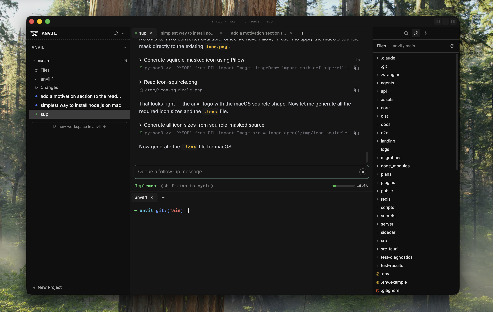

  

<h1 align="center">Anvil</h1>

  <em>More agents, less pain.</em>

  A desktop IDE for parallel agent work. 

  <a href="https://discord.gg/tbkAetedSd">Discord</a> ·
  <a href="https://www.anvil.fm">Download</a>

---

  

## Motivation

I built Anvil after getting tired of managing multiple Claude Code sessions in my terminal. I felt the pain of constantly context switching between terminal tabs and git branches, forgetting which agent did what, agents bumping into each other on the same branch, not knowing when an agent was done or needing input...

Anvil solves the annoyances of parallel agent work, so you can cook on new things while your agents run. Agent lifecycle, isolation, planning and coordination, context hygiene — all handled by the IDE. But more than this, the goal of Anvil is to push the frontier of what is possible with agent programming.

I hope you get a chance to try out Anvil. Let me know if you have any feedback, and please join the [Discord](https://discord.gg/tbkAetedSd).

Let's cook some GPUs together 🔥

## Features

| Feature | Description |
| --- | --- |
| **Workspace management** | Isolated worktrees let you parallelize without merge conflicts. |
| **First-class spec support** | Phase tracking, context hygiene, and plan execution — built into the workflow, not bolted on. |
| **Full IDE** | Terminal, file editor, diff viewer — everything you need in one window. |
| **REPL & orchestration** | Let Claude call other Claudes programmatically. Flexible building blocks, not rigid workflows. |
| **Visual flexibility** | Arrange your agents in up to a 4×3 grid of panels. Your workspace, your layout. |
| **Sub-agent visibility** | No more black boxes. See what child and grandchild agents are actually doing. |

## License

[MIT](LICENSE)
